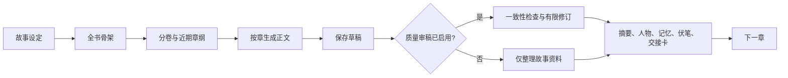

# 墨流（Inkflow）

面向个人小说创作的本地 AI 写作工作台，支持长篇连载与一篇完结的短故事。

长篇模式把全书主线、分卷目标、近期章纲、章节正文、人物状态、已发生事实和伏笔分别管理，再按照章节逐步完成规划、写作、审稿与记忆更新。短故事模式围绕开篇钩子、核心冲突、递进反转、高潮和闭环结局生成一篇完整稿件。两种模式都允许作者修改结构、重写内容或直接接管正文。

> 当前版本：`0.2.0`。项目优先支持 Windows，本地运行，不需要安装第三方 npm 依赖。

## 为什么使用墨流

普通的 AI 续写容易遗忘前文、混入未来剧情，或在重写旧章时引用后续知识。墨流为每一次章节生成建立明确的上下文边界：

- 写第 N 章时，只使用第 N 章之前已经确认的事实。
- 上一章结尾、章节交接卡和本章开篇要求共同控制衔接。
- 未来章纲只作为作者计划，不会被当成人物已经知道的事实。
- 重写旧章时使用当时的故事状态；采用新版后，受影响的后续资料会进入待复核状态。
- 正文先保存为草稿，再执行审稿和记忆更新。请求失败或服务重启后可以从安全步骤继续。



## 核心功能

### 短故事创作

- 新建作品时选择“短故事 · 一篇完结”，目标篇幅支持 6,000–80,000 字，默认推荐 15,000 字。
- 可选择第一人称或第三人称限知；规划阶段生成推荐标题、分类、前三段钩子、核心冲突、情绪曲线、2–4 次反转、高潮和结局。
- 系统只创建一篇完整稿件，不生成分卷或连续章节；输出截断时保留草稿并继续生成。
- “全文与结构”页展示实际写作依据、平台篇幅、正文分段、完结状态和建议试读节点。
- 导出内容是可直接整理发布的纯正文，不附加项目名、章号或创作说明。

短故事的篇幅和试读节点提示参考[番茄小说作家助手的官方教程](https://fanqienovel.com/writer/zone/article/7409917439607062553)。平台签约、审核和发布仍以发布时的官方规则与人工检查为准。

### 长篇规划

- 根据标题、类型、核心创意、文风和目标字数生成全书骨架。
- 管理世界规则、主要人物、分卷目标和伏笔计划。
- 每次扩展 1–10 章近期章纲，可指定目标卷和本批剧情要求。
- 每章可编辑开场状态、出场人物、本章目标、关键转折、必写事件、结束状态、目标字数和写作要求。

### 逐章自动写作

- 自由勾选要生成的章节，系统按章号顺序执行。
- 正文流式显示，并同步更新当前阶段与已生成字数。
- 每章先保存草稿，再审稿、更新记忆并进入下一章。
- 达到模型输出上限时保留已有正文，可从草稿继续生成。
- 支持暂停、恢复和服务重启后的任务续跑。

### 连贯性与故事记忆

- 使用上一章结尾片段和结构化交接卡衔接新章节。
- 记录人物关系、目标、位置、状态、物品、认知和时间线。
- 从正文识别新人物，并保留首次出场章节和重要程度。
- 记忆支持分类筛选、重要度排序、置顶、来源追踪和版本隔离。
- 伏笔记录计划埋设、实际推进和回收状态。

### 审稿与重写

- 检查设定一致性、人物知识边界、时间线、节奏和重复内容。
- 严重连续性问题会暂停后续写作，避免错误继续扩散。
- 审稿失败时保留正文，可单独重新审稿，无需再次生成正文。
- 任意已有章节都能按自定义要求生成候选稿；确认采用前不会覆盖原文。
- 关闭质量审稿后仍会整理摘要、记忆和交接卡，保证后续章节可以承接。

### 模型动态与查重

- 在工作台查看每次模型调用的角色、章节、状态、耗时、Token 预算、用量、请求和返回文本。
- 四类任务可以使用不同服务商、接口、模型、密钥和输出额度。
- 对当前章节提取代表性句段并执行网络相似度检查，保存命中来源与片段。

## 快速开始

### 运行要求

- Windows 10/11，或可运行 Node.js 的其他桌面系统
- Node.js `22.5` 或更高版本，需要包含内置 `node:sqlite`
- 使用真实 AI 时，需要一个兼容 Responses API 或 Chat Completions API 的模型服务

项目不依赖第三方 npm 包，克隆后即可运行。

### Windows 一键启动

克隆或下载项目后，双击：

```text
启动墨流.cmd
```

启动器会依次查找：

1. 系统已经安装的 Node.js；
2. 项目中的 `runtime/node.exe`；
3. 本机 Codex 附带的兼容 Node.js 运行环境。

服务就绪后会自动打开 <http://127.0.0.1:4310>。重复启动会复用现有服务，启动日志保存在 `data/server.log` 和 `data/server-error.log`。

### 命令行启动

```powershell
git clone https://github.com/CUN0921/inkflow-ai-novel-studio.git
cd inkflow-ai-novel-studio
node server.mjs
```

浏览器访问 <http://127.0.0.1:4310>。首次运行会创建本地数据库和一部演示作品。

## 配置模型

推荐直接在工作台左下角打开“模型与审稿”。每个角色都可以分别设置 API 地址、协议、模型名称、密钥、推理模式和单次输出 Token 预算。

| 角色 | 用途 | 默认预算 | 额外要求 |
| --- | --- | ---: | --- |
| 故事规划 | 全书骨架、分卷和近期章纲 | 8,000 | 返回结构化 JSON |
| 正文写作 | 新章节、续写和重写候选稿 | 24,000 | 建议使用长文本能力较强的模型 |
| 审稿整理 | 审稿、摘要、人物状态和交接卡 | 6,000 | 返回结构化 JSON；DeepSeek 默认关闭思考 |
| 网络查重 | 搜索相似网页并整理证据 | 6,000 | 必须支持 Responses 协议和 `web_search` 工具 |

设置保存到本机 `data/model-settings.json`。密钥不会回显到浏览器，也不会写入作品数据库；该文件已被 Git 忽略。

系统支持两种协议：

- `responses`：Responses API
- `chat`：Chat Completions API

API 地址既可以填写基础路径，例如 `https://api.example.com/v1`，也可以填写完整路径，例如 `https://api.example.com/v1/responses`。保存后可点击“测试已保存的连接”逐项验证。

API 配置只有这一处来源，保存后立即生效并在重启后继续使用。首次使用时请依次完成四个角色的设置；暂时不需要网络查重时，也可以先为该角色复用其他模型配置。

### 可选启动参数

部署或测试时，可以通过系统环境变量调整本地运行路径。这些变量不包含模型 API 配置：

| 变量 | 作用 | 默认值 |
| --- | --- | --- |
| `PORT` | 本地服务端口 | `4310` |
| `NOVEL_DB_PATH` | 作品数据库路径 | `data/novels.db` |
| `NOVEL_SETTINGS_PATH` | 模型设置文件路径 | 与数据库相同目录下的 `model-settings.json` |

## 推荐创作流程

1. 新建作品，填写题材、核心故事、文风和目标字数。
2. 生成全书规划，检查世界规则、人物目标和分卷方向。
3. 编辑近期章纲，为关键章节补充必写事件和结尾状态。
4. 先选择一章试写，校准模型、文风与目标字数。
5. 查看审稿结果、章节交接卡和新增记忆，再批量选择后续章节。
6. 对不满意的章节生成重写候选稿，对照确认后再采用。
7. 定期检查人物档案、重要记忆和伏笔状态，处理系统提示的矛盾。
8. 完成后从工作台导出全文 TXT。

## 数据与隐私

墨流默认把所有创作数据保存在本机：

```text
data/
├── novels.db             # 作品、章节、版本、记忆和任务记录
├── model-settings.json   # 模型配置与密钥
├── server.log            # 启动日志
└── server-error.log      # 错误日志
```

整个 `data/` 目录和日志文件都不会被 Git 提交。调用 Responses API 时会发送 `store: false`；模型服务商如何处理请求仍以你所使用服务的条款为准。

备份作品时，请先停止正在运行的写作任务，再复制 `data/novels.db`。如果需要迁移模型配置，请单独安全保存 `data/model-settings.json`，不要把它上传到公开仓库。

## 项目结构

```text
inkflow-ai-novel-studio/
├── public/                 # 工作台界面
├── scripts/                # 启动器与浏览器回归脚本
├── src/
│   ├── ai.mjs              # 多模型路由、协议适配与返回解析
│   ├── chapter-context.mjs # 章节知识边界与写作上下文
│   ├── database.mjs        # SQLite 数据模型与版本管理
│   ├── rewrite-service.mjs # 单章重写流程
│   ├── similarity-service.mjs
│   ├── studio-settings.mjs
│   └── writing-engine.mjs  # 规划、写作、审稿与恢复流程
├── test/                   # Node.js 自动测试
├── server.mjs              # HTTP 服务与 API 路由
└── 启动墨流.cmd
```

更详细的上下文规则见[章节控制与章纲扩展逻辑](docs/章节控制与章纲扩展逻辑.md)。

## 测试

运行完整自动测试：

```powershell
node --test
```

运行本机浏览器回归测试：

```powershell
node scripts/qa-start-create.mjs
```

浏览器回归测试使用独立临时数据库，不会改动现有作品；它需要 Chrome 和本机 Codex Playwright 运行环境。

## 常见问题

### 页面无法打开

确认 Node.js 版本满足要求，并查看 `data/server-error.log`。如果修改了端口，请使用新的地址访问。

### 模型显示未配置

先在“模型与审稿”中检查密钥、模型名、API 地址和协议，再点击连接测试。完整的 `/responses` 地址应选择 `responses`，完整的 `/chat/completions` 地址应选择 `chat`。

### 正文已经生成，但审稿失败

正文会保留为待审稿草稿。修正模型配置或网络问题后，点击“重新审稿”，无需重新生成正文。

### 模型返回 JSON 校验失败

墨流会修复字符串内部常见的未转义控制字符，但缺少必要字段、内容截断或结构损坏仍会失败。可以在“模型动态”中查看返回内容和 Token 用量，再提高审稿预算或重新审稿。

### 修改旧章后，后续资料显示待复核

这是知识边界保护机制。旧章内容改变后，相关摘要、记忆和交接卡可能已经失效；请重新整理受影响章节，再继续自动写作。
